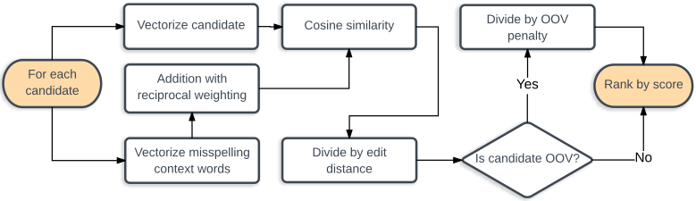
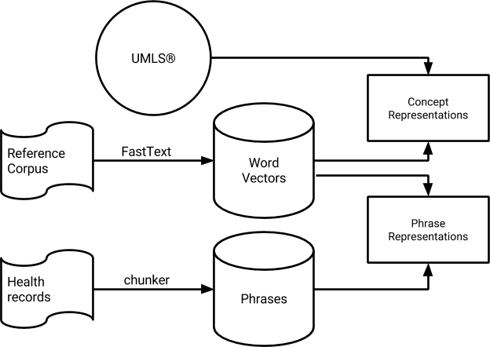
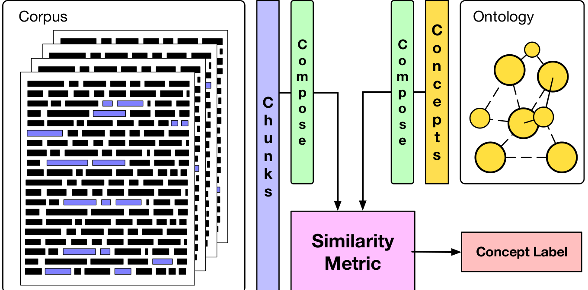

# &#9971; Software for Clinical Natural Language Processing

This is a summary of openly available implementations (software deliverables) created in the [Accumulate](http://www.accumulate.be/) project at [CLiPS](https://www.uantwerpen.be/en/rg/clips/).

## List of repositories
### Text Normalization (deliverable 2.2)
- [clinspell](https://github.com/clips/clinspell): Clinical spelling correction with word and character n-gram embeddings

### Concept Extraction and Disambiguation (deliverable 2.3)
- [yarn](https://github.com/clips/yarn): Disambiguating biomedical and clinical concepts with word embeddings

- [conch](https://github.com/clips/conch): Extracting medical concepts and terminology from patient records, and linking them to UMLS CUI 

### Event Semantics (deliverables 3.1-3.3)

- [clicr](https://github.com/clips/clicr): Machine reading and question answering on clinical case reports 

- [memory-networks](https://github.com/clips/memory-networks): Memory networks for medical machine reading

## Contributors
[Walter Daelemans](https://www.clips.uantwerpen.be/~walter/), [Pieter Fivez](https://www.clips.uantwerpen.be/people/pieter-fivez), [Simon Šuster](http://simonsuster.github.io/), [Stéphan Tulkens](http://stephantul.github.io/), [Madhumita Sushil](https://madhumitasushil.github.io/))

## Licensing
See individual repositories.
